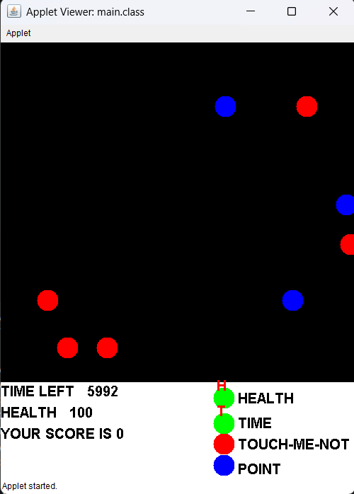

# Shoot

## Overview

This is a simple mini game that I created in Class 9 using Java Applet technology. The project was built as an introduction to game development and interactive graphical applications in Java.

The original source code has mostly been lost due to hard disk corruption, but I was able to recover and decompile the executable saved in cloud, which is preserved in this repository.

## Learning Outcomes

### Java Applet Development

* Learned how Java Applets work and how they are embedded and executed.
* Explored the Applet lifecycle, including initialization, rendering, and user interaction.
* Gained experience working with graphical user interfaces in Java.

## Technologies Used

* Java 8
* Java Applet
* Java AWT Graphics

## Screenshots

### Gameplay

## Conclusion

This project introduced me to the fundamentals of game development, graphics programming, and event-driven applications in Java. It was one of my earliest programming projects and helped me develop a deeper interest in software development.
